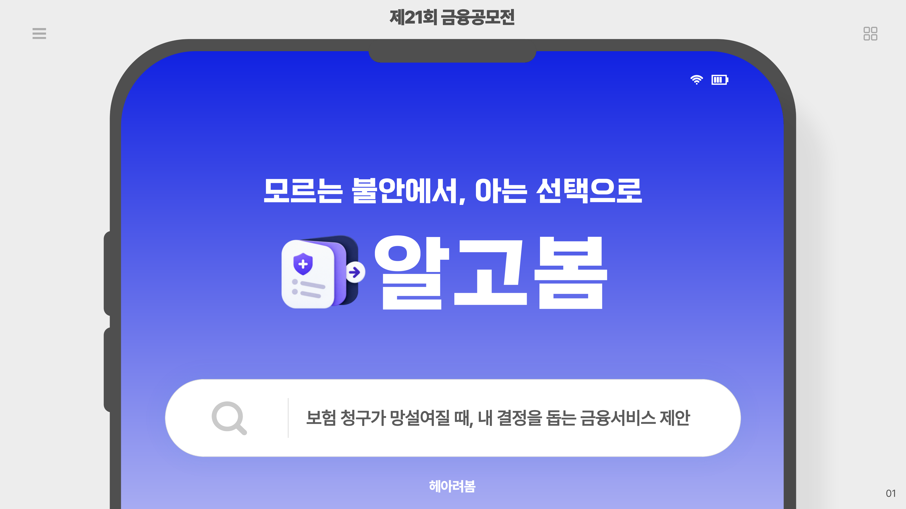
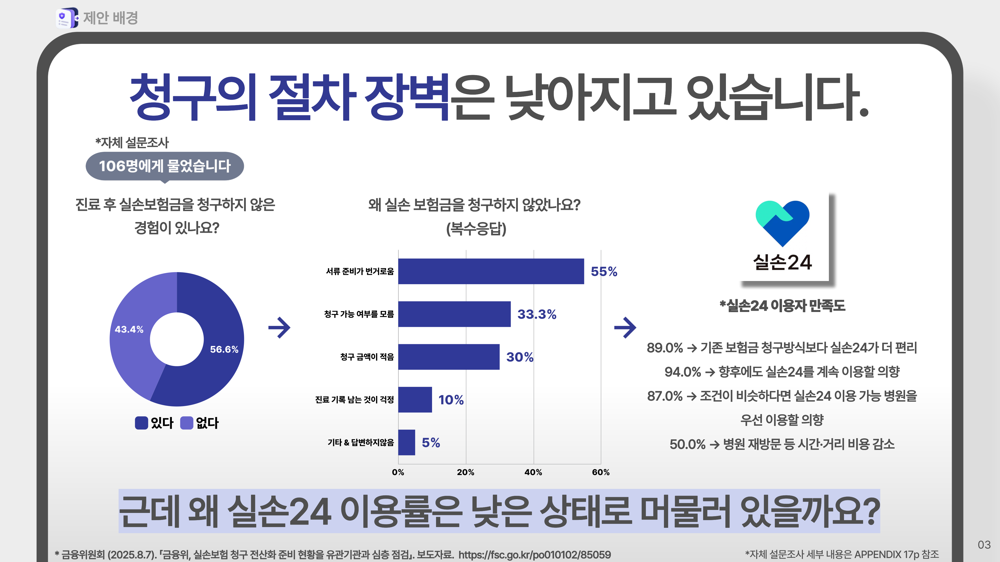
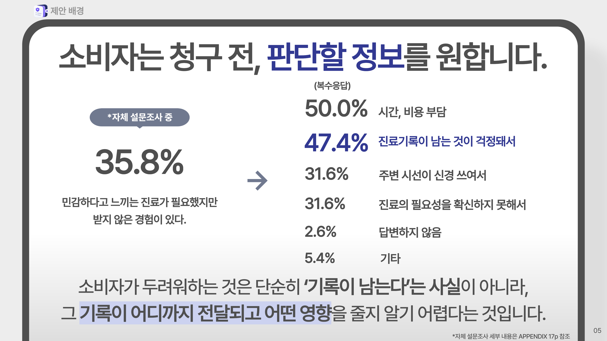
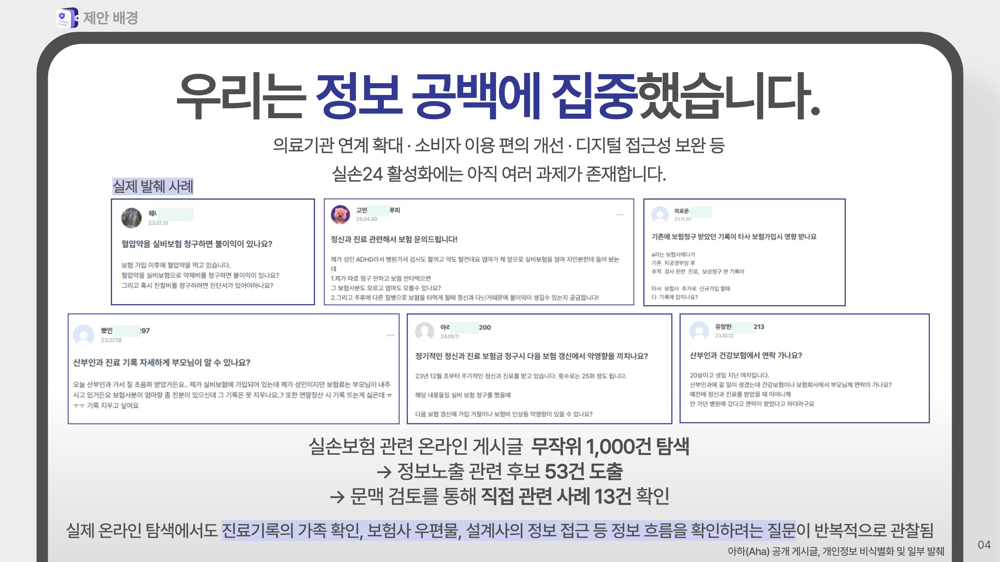
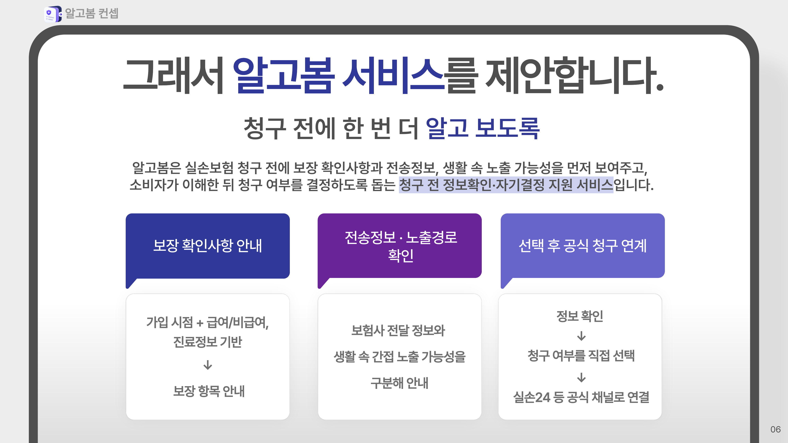
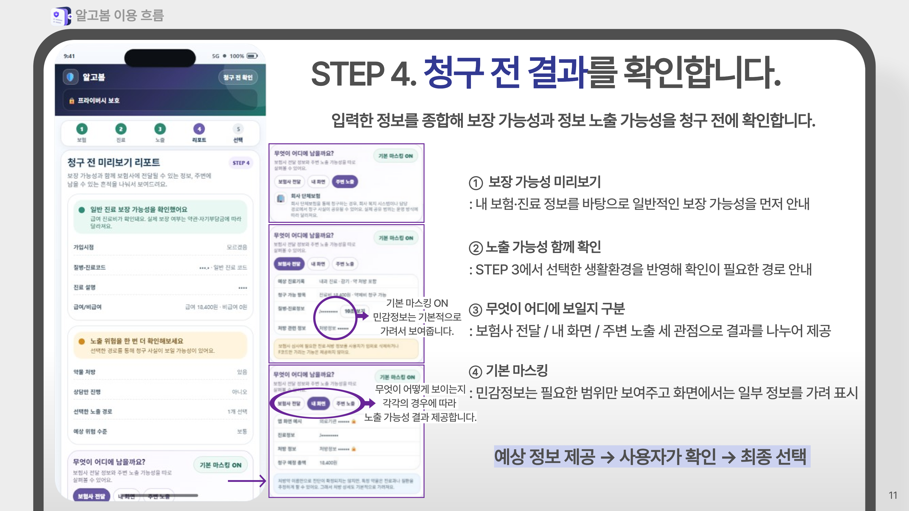
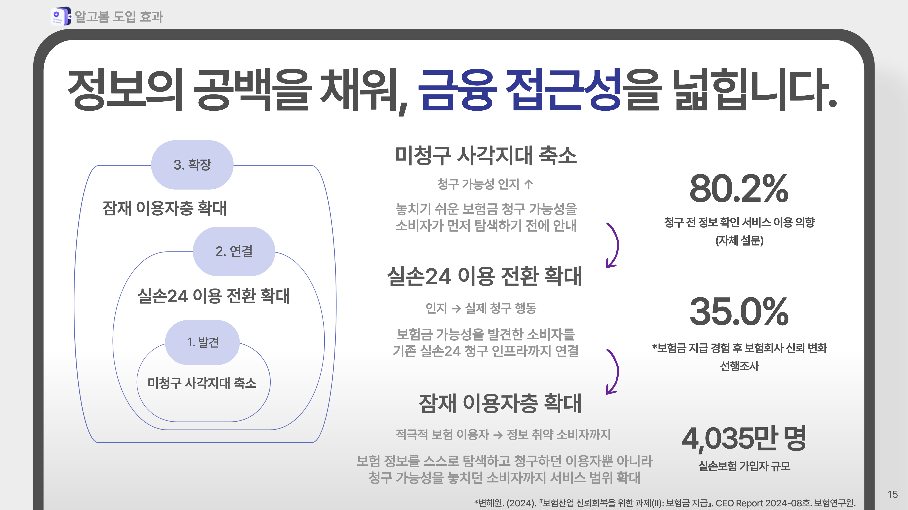

# 알고봄 (Algobom)

> **모르는 불안에서, 아는 선택으로**  
> 실손보험 청구 전에 보장 확인사항과 정보 전달·노출 가능성을 살펴보고, 소비자가 청구 여부를 직접 선택할 수 있도록 돕는 서비스 기획



**2026 제21회 금융공모전 | 금융서비스 기획 · 금융소비자보호 · UX 프로토타입**

| 구분    | 내용                                                                                                                                                       |
| ----- | -------------------------------------------------------------------------------------------------------------------------------------------------------- |
| 프로젝트  | 알고봄 — 보험 청구가 망설여질 때, 내 결정을 돕는 금융서비스 제안                                                                                                                   |
| 진행 형태 | 2인 팀 프로젝트                                                                                                                                                |
| 핵심 작업 | 소비자 설문 · 온라인 질문 수집 및 텍스트 분석 · 서비스 기획 · 프로토타입                                                                                                             |
| 산출물   | [최종 발표자료](./presentation/presentation_algobom_final.pdf) · [데이터 수집 코드](./notebooks/01_data_collection.ipynb) · [텍스트 분석 코드](./notebooks/02_hybrid_text_analysis.ipynb) |

---

## 01. 문제 정의

실손24를 통해 청구 절차는 간편해지고 있지만 **청구를 시작하기 전에 소비자가 판단해야 하는 문제**는 남아 있다. 가입 시점과 세대별 보장 구조, 청구 가능 여부, 보험사에 전달되는 정보, 일상에서 그 정보가 보일 수 있는 경로를 소비자가 직접 확인해야 하기 때문이다.

자체 설문조사에서는 진료 후 실손보험금을 청구하지 않은 경험이 있다는 응답이 **56.6%(60/106명)**였다. 미청구 이유로는 서류 준비의 번거로움뿐 아니라 청구 가능 여부를 모르거나 진료 기록이 남는 것에 대한 걱정도 나타났다.



**프로젝트 질문**  
*청구 절차를 더 단축하는 것에 앞서, 소비자가 필요한 정보를 이해하고 스스로 선택할 수 있도록 도울 방법은 없을까?*

## 02. 사용자 조사와 데이터 분석

### 소비자 설문 · 106명

보험금 청구 경험, 민감한 진료의 이용 경험, 정보 이해도와 청구 전 안내 서비스 수요를 조사했다.

| 주요 응답 | 결과 |
|---|---:|
| 진료 후 실손보험금을 청구하지 않은 경험 | 56.6% (60/106명) |
| 민감하다고 느끼는 진료가 필요했지만 받지 않은 경험 | 35.8% (38/106명) |
| 청구 전 정보 확인 서비스 이용 의향 | 80.2% (85/106명) |

설문은 프로젝트의 문제 정의와 기능 설계에 활용한 자체 조사이며, 전체 보험소비자를 대표하는 통계로 해석하지 않았다.



### 온라인 질문 분석 · 1,000건

보험 관련 질문 게시글을 수집하고, **SBERT 의미 유사도 + 정보노출 관련 Rule**을 결합해 소비자가 어떤 정보 흐름을 걱정하는지 탐색했다.

```text
보험 관련 게시글 1,000건
        ↓
SBERT 의미 유사도 분석
        +
정보노출 관계 Rule 적용
        ↓
관련 후보 53건
        ↓
원문 문맥 검토
        ↓
직접 관련 사례 13건
```

단일 키워드 빈도만 보는 대신, 제3자·노출 표현·전달 경로·민감정보·사생활 우려의 관계를 함께 살펴보았다. 가족의 진료 기록 확인, 우편물, 보험설계사의 정보 접근 등 **정보가 누구에게 어떤 경로로 보이는지**에 관한 질문을 확인했다.

53건은 코드로 추출한 후보군이고, **13건은 후보 원문을 직접 검토한 결과**다. 자동 분류의 최종 정답 건수로 표현하지 않았다.



[데이터 수집 노트북](./notebooks/01_data_collection.ipynb) · [SBERT + Rule 분석 노트북](./notebooks/02_hybrid_text_analysis.ipynb)

## 03. 서비스 제안

**알고봄은 ‘청구 전 정보 확인·자기결정 지원’ 서비스다.**

가입 시점에 따른 보장 확인사항, 진료 정보와 전달·노출 가능성을 청구 전에 안내하고, 소비자가 이해한 후 청구 여부를 결정하도록 설계했다. 보험금 지급 여부를 확정하거나 청구를 대신 결정하는 서비스는 아니다.



서비스 설계의 기준은 세 가지였다.

- **보장 확인사항 안내:** 가입 시점, 급여·비급여, 진료 정보 등을 함께 고려해 확인할 항목 제시
- **정보 전달·노출경로 안내:** 보험사 전달 정보와 생활 속에서 정보가 보일 수 있는 상황을 구분
- **선택 후 공식 채널 연결:** 안내를 확인한 소비자가 청구 여부를 정하고 실손24 등 공식 청구 채널로 이동

## 04. 사용자 흐름과 프로토타입

| 단계 | 주요 화면과 역할 |
|---|---|
| 1. 가입 시점 확인 | 가입 시점에 따른 실손보험 구조와 보장 확인사항 안내 |
| 2. 진료 정보 확인 | 진료 코드 또는 간단한 설명, 급여·비급여 등 핵심 정보 입력 |
| 3. 노출경로 점검 | 회사 단체보험, 가족과 공유하는 우편물·기기 등 생활환경 확인 |
| 4. 청구 전 리포트 | 일반적인 보장 가능성 및 보험사 전달·내 화면·주변 노출 정보를 구분해 제시 |
| 5. 최종 선택 | 지금 청구 / 더 확인 / 이번에는 청구하지 않기 중 직접 선택 |



프로토타입에서는 민감정보가 어느 화면에 어떻게 보이는지를 구분하고, 사용자가 필요한 내용을 확인한 뒤 선택할 수 있도록 구성했다. 전체 5단계 화면은 [최종 발표자료 8–12쪽](./presentation/algobom_final.pdf)에서 확인할 수 있다.

## 05. 도입 방향과 기대효과

알고봄은 별도의 청구 시스템을 새로 구축하기보다 **실손24에 진입하기 전 필요한 정보를 확인하는 안내 단계**를 제안한다. 발표자료의 연계 로드맵은 실제 연동 완료가 아닌 단계적 도입 구상이다.



**발견 → 연결 → 확장**

- 청구 가능성과 정보 전달 범위를 몰라 청구를 망설이는 상황에 안내 제공
- 정보 확인 후 기존 실손24 등 공식 청구 채널로 이어지는 경로 마련
- 보험 지식이나 정보 탐색 역량에 따른 이용 격차를 줄이고 잠재 이용자까지 접근 범위 확대

이는 서비스 도입 시 **기대하는 효과**이며, 실제 도입 후 개선 성과를 측정한 결과는 아니다.

## 06. My Contribution

**2인 팀 프로젝트**로 문제 정의와 서비스의 주요 방향은 팀원과 함께 논의하고 결정했다. 아래는 그 과정에서 직접 맡아 진행한 작업이다.

| 영역 | 담당 내용 |
|---|---|
| 사용자 조사 | 설문 문항 구성 및 설문 제작 |
| 데이터 분석 | 보험 관련 온라인 질문 크롤링, SBERT·Rule 기반 텍스트 분석 |
| 서비스 기획 | 아이디어 공동 기획, 조사 결과를 바탕으로 기능 및 사용자 흐름 구체화 |
| 프로토타입 | 가입 시점 확인부터 청구 전 리포트와 최종 선택까지 화면·흐름 구현 |

## 07. Files

```text
assets/                         README 이미지 7장
notebooks/
  01_data_collection.ipynb     온라인 보험 질문 수집
  02_hybrid_text_analysis.ipynb SBERT + Rule 기반 후보 추출
presentation/
  algobom_final.pdf             최종 발표자료
requirements.txt               분석 코드 실행에 필요한 패키지
```

온라인 게시글 원문과 설문 개별 응답은 공개 저장소에 포함하지 않았다. 노트북은 공모전에서 사용한 분석 흐름을 공개용으로 정리한 코드이며, 사이트 환경이나 수집 시점에 따라 재실행 결과가 달라질 수 있다.

---

*본 저장소는 금융공모전 출품을 위한 서비스 기획 및 프로토타입 기록이다. 실제 보험금 지급 여부를 판정하지 않으며, 실손24 또는 보험사 시스템과의 실서비스 연동을 구현한 것은 아니다.*
